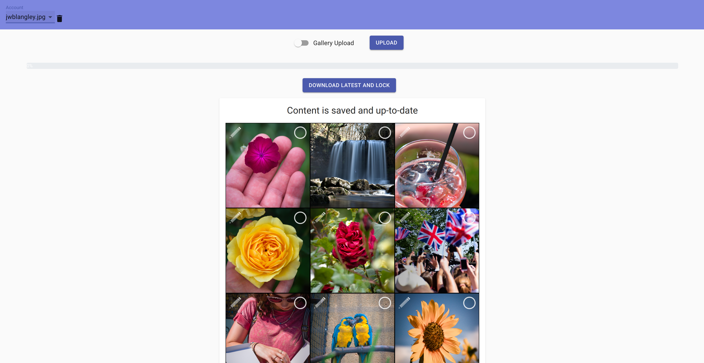
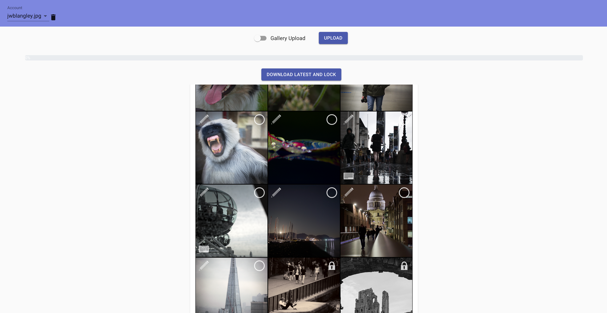
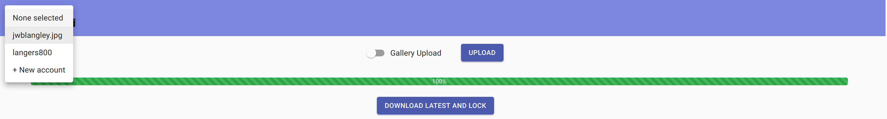
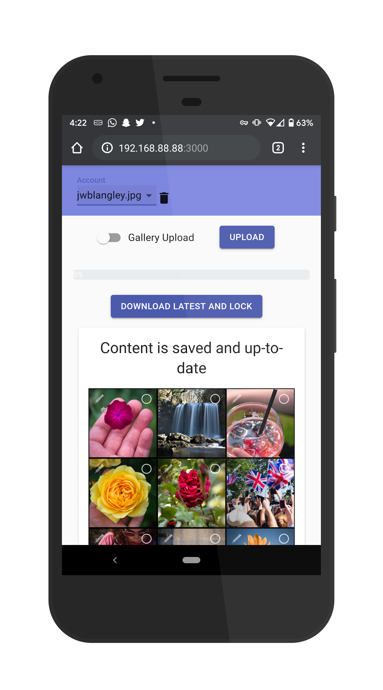
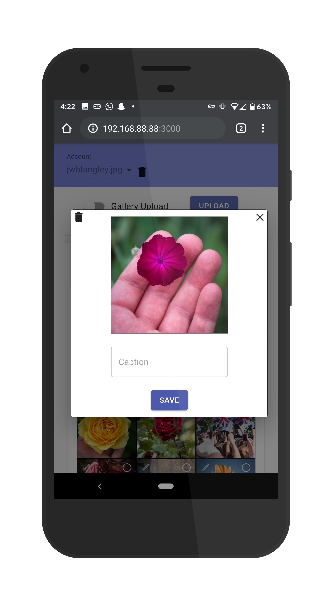
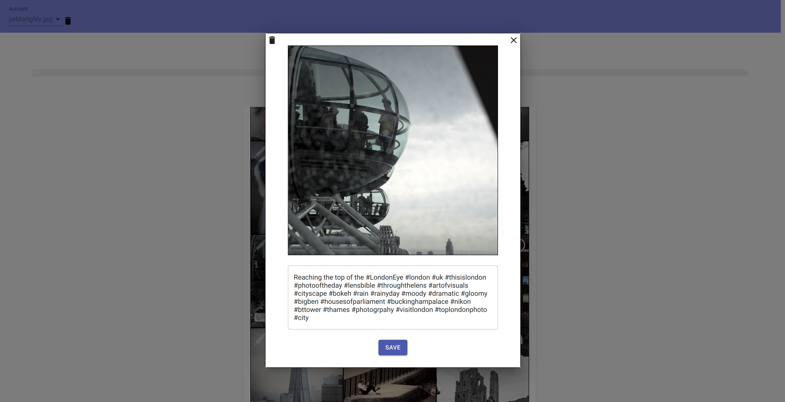
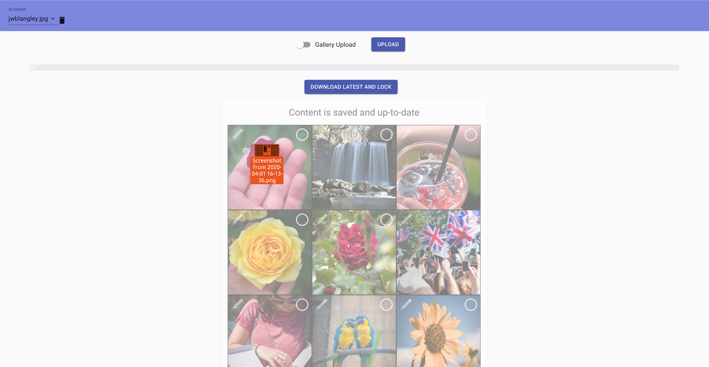
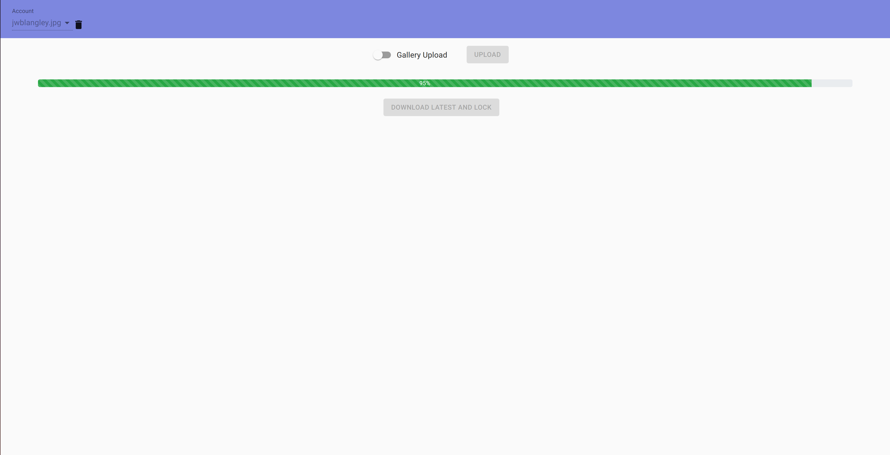
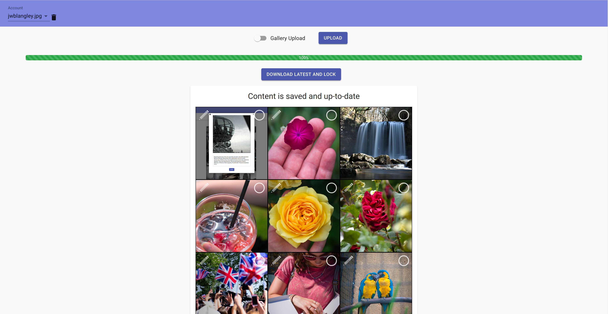

# About

A picture organiser for grid layouts such as [Instagram](https://instagram.com).

Features include:
* Drag-and-drop upload
* Reordering
* Captioning
* Video Support
* Gallery Support
* One-click download
* Lock organisation to keep track of which photos have been posted

## Screenshots

<br /><br />

<br /><br />

<br /><br />


<br /><br />

<br /><br />

<br /><br />

<br /><br />


# Production launch
1. Configure the application following the [configuration](#configuration) steps for the frontend and the backend.

2. Run the following:

  ```
  npm install --prefix frontend
  npm install --prefix backend
  bash launch.sh
  ```

  N.B: The launch script requires `tmux` to be installed.

  The frontend and backend will now be run in detached tmux sessions. You can reattach them with `tmux a -t plo-frontend` and `tmux a -t plo-backend` respectively.

# Backend

## Configuration

Edit the file `backend/run.sh` to change the data directory location - this is where all uploaded media content will be stored. By default this is the folder `.plo` in the home directory

If required edit the port number in `run.sh`; the default is 8008. This should match the port number entered in the frontend config.

* Requires `bash`, `ffmpeg`  and `mongo` to be installed.
* Ensure that the mongo data store path is set. This can be done with `mongod --dbpath <location>`. It is recommended to use `/data/db`.

<hr>

## Available Scripts

### `npm start`
Runs the backend application

### `plo-export`
Saves all stored content to `export.zip`

### `plo-import`
Restores all content from a previous export.

Usage: `./plo-import export.zip`

### `plo-compress-existing`
For existing applications prior to the introduction of image compression.
Compresses existing images in the application to be in line with newer versions.

Usage: `./plo-import export.zip`


# Frontend

## Configuration
Before running this project, create a `.env` file in the frontend directory with the contents:

```
REACT_APP_BACKEND_PORT_BASE=<backend port number>
REACT_APP_SELF_BACKEND=<true|false>
```

* The default backend port number is 8008 (N.B: The backend actually uses two successive ports starting with the given port number).
* If you host the frontend on the same server as the backend, you can remove the need for inputting the backend address by setting the REACT_APP_SELF_BACKEND vairable to `true`

<hr>

## Available Scripts

In the project directory, you can run:

### `npm start`

Runs the app in the development mode.<br>
Open [http://localhost:3000](http://localhost:3000) to view it in the browser.

The page will reload if you make edits.<br>
You will also see any lint errors in the console.

### `npm test`

Runs the test suite.
See the section about [running tests](https://facebook.github.io/create-react-app/docs/running-tests) for more information.

### `npm run build`

Builds the app for production to the `build` folder.<br>
It correctly bundles React in production mode and optimizes the build for the best performance.

The build is minified and the filenames include the hashes.<br>
Your app is ready to be deployed!

See the section about [deployment](https://facebook.github.io/create-react-app/docs/deployment) for more information.
